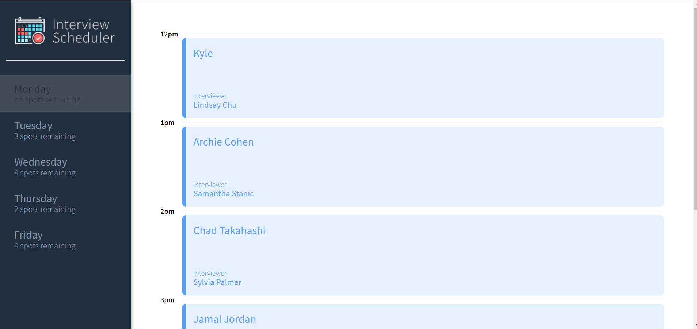
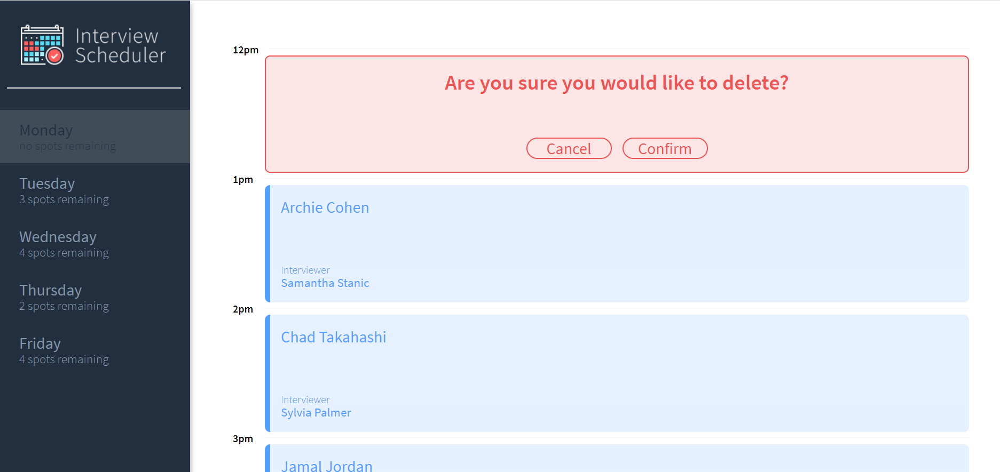

# Interview Scheduler

## Project Description
Interview Scheduler is a SPA (Single Page Application) for tracking students interviews built with the latest tools and techniques for optimized user experience. 
It allows users to add,edit and delete appointments in real time

### Daily view

### New appointment booking

### Interview Cancelation



## Project Stack
Front-End:React,Axios,HTML,SASS,JavaScript <br/>
Back-End: Express,Node.js,PostgresSql<br/>
Testing:Storybook,Jest, Testing Library and Cypress
## Setup

Install dependencies with `npm install`.

## Running Webpack Development Server

```sh
npm start
```

## Running Jest Test Framework

```sh
npm test
```

## Running Storybook Visual Testbed

```sh
npm run storybook
```
